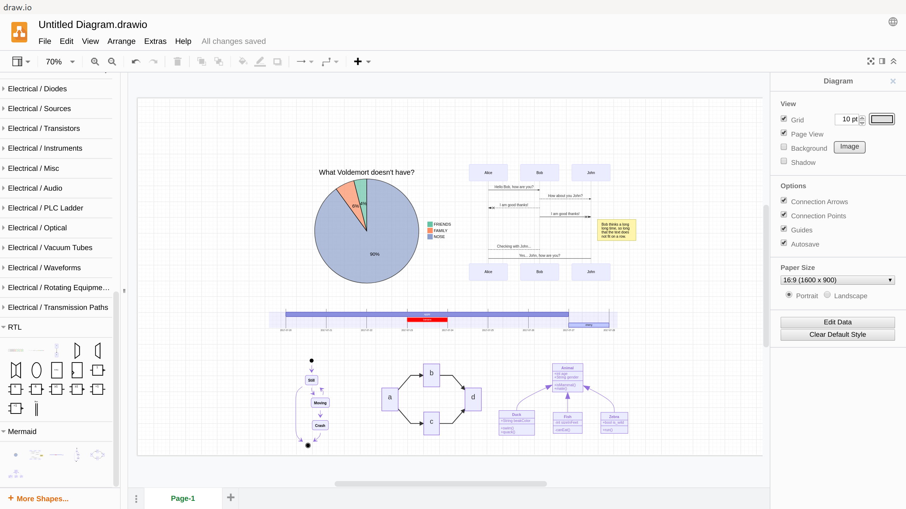
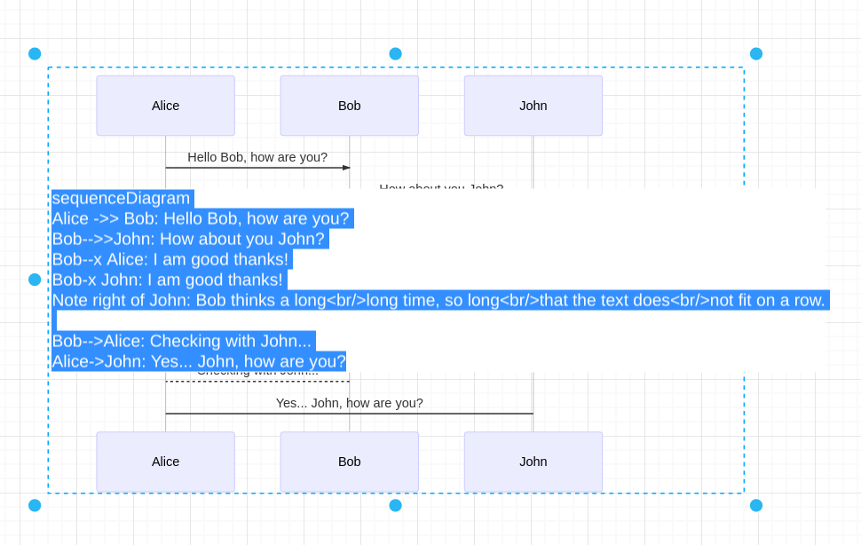
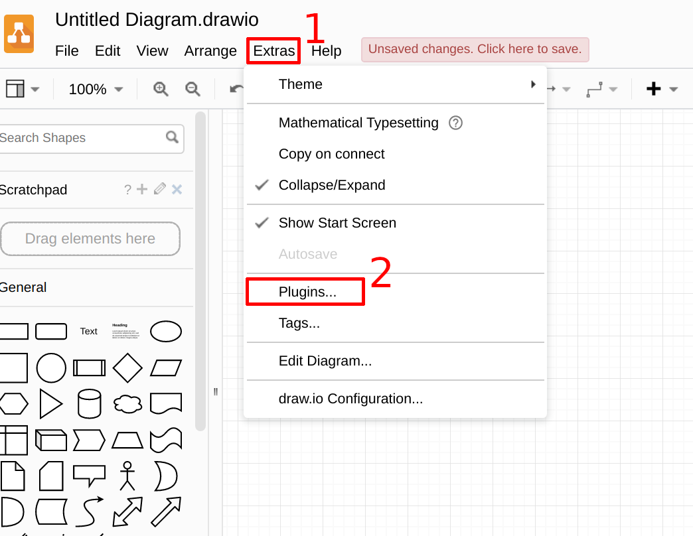
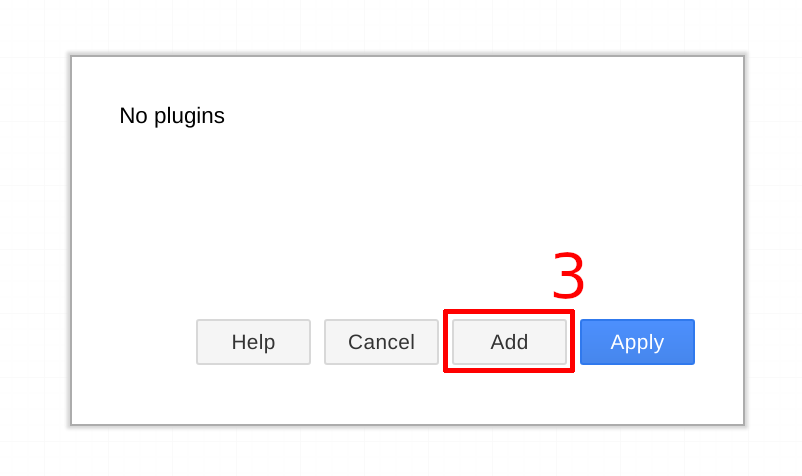
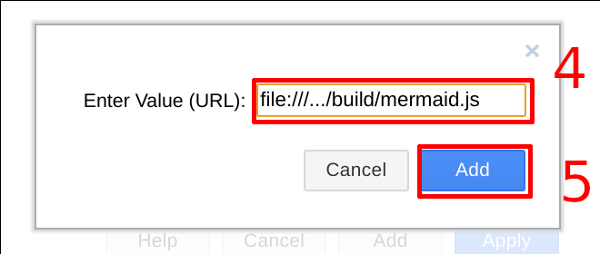
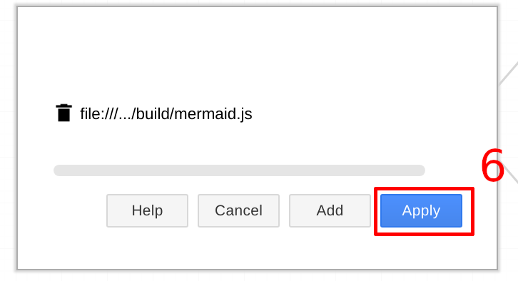

# drawio_mermaid_plugin

This draw.io plugins integrates the mermaid diagram generator.

Mermaid supports:
* Pie charts
* Sequence diagrams
* Gantt diagrams
* State diagrams
* Flow charts
* Class diagrams

via a simple markup language

## Online Demo
[Online Demo](https://nopeslide.github.io/drawio/?p=mermaid)

## Usage

* double click on a shape and edit the mermaid script, the shape will be redrawn after leaving the editor

## Installation

* clone repository

* start draw.io desktop
* click on `Extras` , then `Plugins...`

* click `Add`

* enter path to cloned git as `file://` uri and append `/build/mermaid.js` and click `Add`

* check path and click `Apply`

* confirm dialog and restart draw.io

* if the library does not appear on the left side (last entry)
  * check plugin dialog if path was saved
    * if not, remove the directory `~/.config/draw.io` und install again
